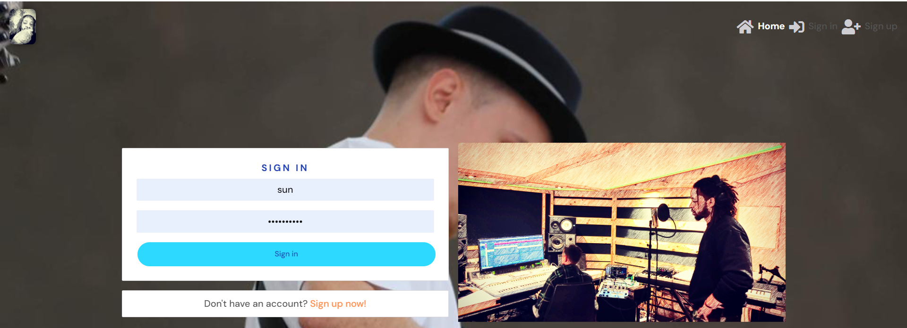
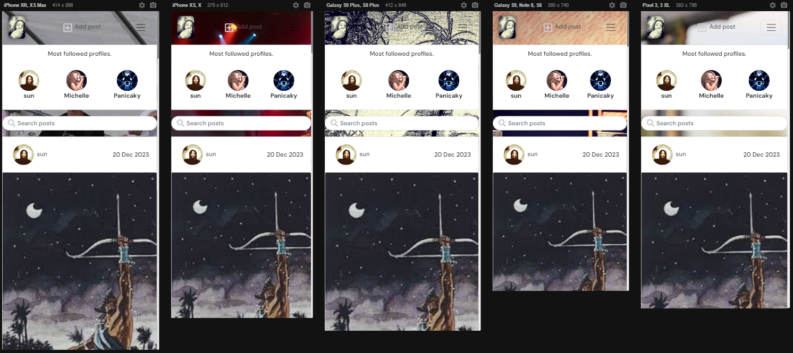
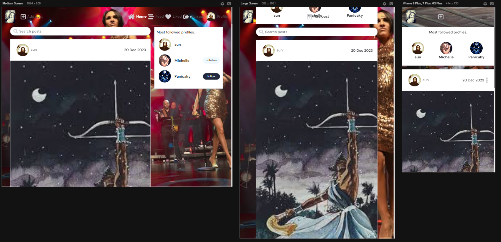
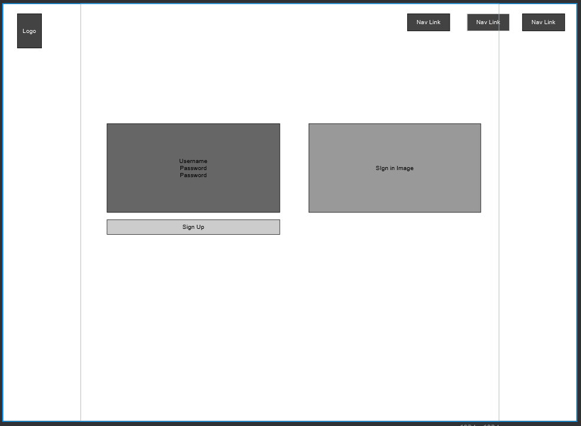
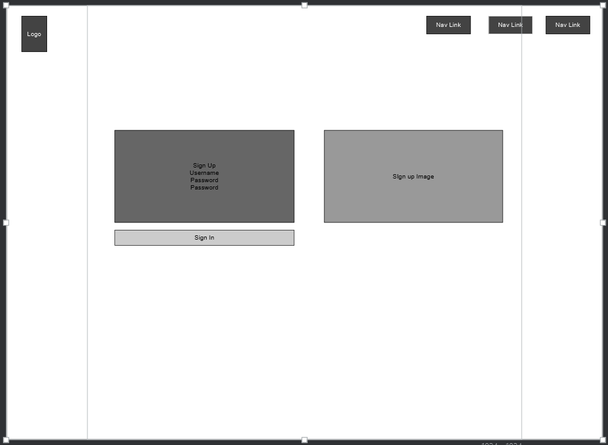
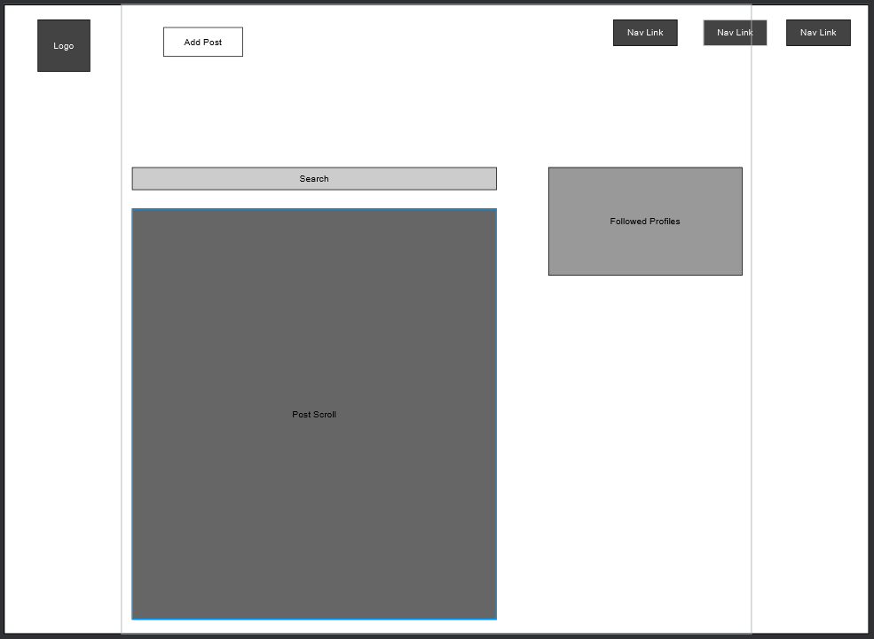
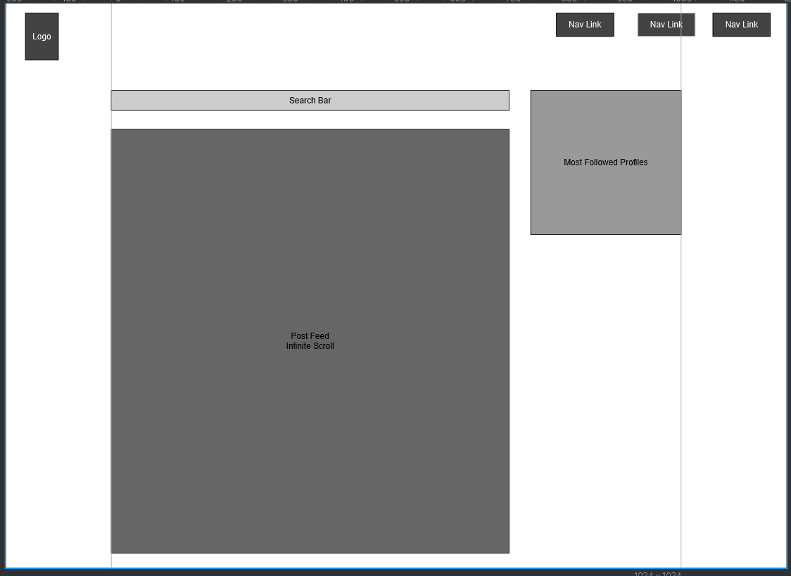
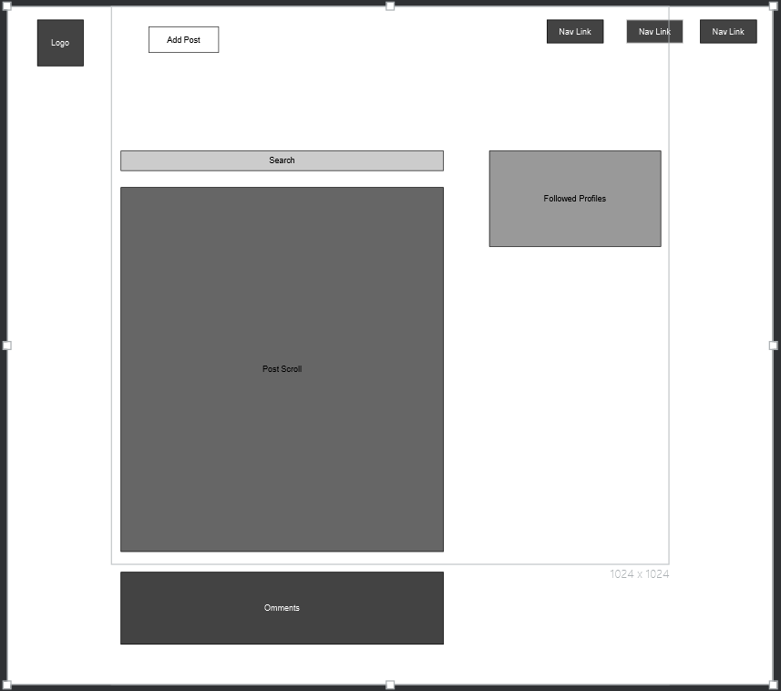

Soul Carnival is your go-to platform for musicians to share their creative journey and connect with a vibrant community of like-minded artists. Whether you're a seasoned musician, an emerging talent, or just passionate about music, Soul Carnival provides a space to showcase your artistry. Share your musical creations, from soulful melodies to energetic beats, accompanied by the stories and inspiration behind each piece.

Engage with fellow musicians, discover new sounds, and build meaningful connections within the Soul Carnival community. Whether you're into collaborative projects, seeking feedback on your latest track, or simply connecting with other music enthusiasts, Soul Carnival is the place to be.

Stay tuned for exciting updates as we evolve our platform to include features like messaging, video uploads, and an about landing page, introducing the community and upcoming events. The stage is set for a musical journey filled with creativity, camaraderie, and endless inspiration.

Join Soul Carnival today and let the rhythm of connection and collaboration amplify your musical experience.

# Responsiveness Mock-up

Developer: [Roger Davis](https://github.com/RogerWDavis)  
[Live webapp](https://duggiezb-7eefa269f2cf.herokuapp.com/)  
[Repository](https://github.com/RogerWDavis/duggiez-backend)  
[FrontEnd Repository](https://github.com/RogerWDavis/duggiezf.git)  

## Table of Contents

- [User experience](#user-experience)
  * [Objective:](#objective-)
  * [Strategy](#strategy)
    + [Project Goals](#project-goals)
    + [User Goals](#user-goals)
    + [Site Owner Goals](#site-owner-goals)
    + [Target Audience](#target-audience)
    + [User Requirements and Expectations](#user-requirements-and-expectations)
  * [Scope](#scope)
    + [Features](#features)
    + [Future Features](#future-features)
    + [User Stories](#user-stories)
  * [Structure](#structure)
    + [Database](#database)
  * [Component Architecture and Reusability](#component-architecture-and-reusability)
    + [Core Components](#core-components)
    + [Component Pages](#component-pages)
  * [Skeleton](#skeleton)
    + [Wireframes](#wireframes)
- [Technologies Used](#technologies-used)
  * [Languages](#languages)
  * [Frameworks.](#frameworks)
  * [Database](#database-1)
  * [Tools](#tools)
  * [Supporting Libraries and Packages](#supporting-libraries-and-packages)
- [Methodology](#methodology)
  * [Agile Project Management with GitHub Projects](#agile-project-management-with-github-projects)
  * [User Stories as GitHub Issues](#user-stories-as-github-issues)
  * [Bug Tracking](#bug-tracking)
- [Bugs](#bugs) 
- [Testing](#testing)
- [Deployment](#deployment)
- [Credits](#credits)
- [Acknowledgements](#acknowledgements)

## User Experience
The Soul Carneval platform is designed to cater to a diverse range of users who share a common interest in music and community. 

### Objective:
The objective of Soul Carneval is to create a community platform that caters to the needs and expectations of music enthusiasts.

### Strategy

#### Project Goals 

- **Create a music community Platform:** Develop a user-friendly web application that allows travelers to save and share their content in the form of text and pictures. Provide a seamless experience for users to upload content, comment on others content. Enable users to create, read, comment, and like others contents. 
 

- **Build a music Community:** Foster a vibrant community of musicians by enabling users to connect with each other, follow fellow music lovers, and like and comment on their content. 
 
  
- **Offer Seamless Travel Exploration:** Implement features that enhance the travel exploration process, such as enable travelers to search and filter content based on username, popularity, date created, title, content keywords, and category. Provide search functionality that allows users to easily find relevant content and resources. 
  

- **Provide a Clean and Intuitive User Interface:** Design an aesthetically pleasing and user-friendly interface. Ensure the application meets accessibility guidelines, follows UX design principles, and provides a set of user interactions that intuitively guide users through the platform. Implement responsive design to ensure the application is accessible and functional across different devices. 
  Mapped to all user stories.
  
- **Implement Advanced Features *(if time permits)*:** Explore the possibility of implementing additional features, such as direct messaging, audio and video upload, an about page with an event schedule and a blog page. 
  

  #### User Goals
- **Capture and share music related content:** Users want to share and preserve their musical experiences in a secure and organized manner.

- **Discuss Content:** Users aim to share share how they have been impacted by each others content.

- **Discover New Music:** Users are interested in exploring new content and discovering recommendations and tips shared by other community members.

- **Connect with Fellow Musicians:** Users want to connect with like-minded people, follow their journeys, and engage in meaningful interactions.

- **Access a User-Friendly Platform:** Users expect a user-friendly and intuitive platform that is easy to navigate, provides a seamless uploading and sharing experience, and offers search and filter functionalities for finding relevant content.

#### Site Owner Goals
- **Create a Vibrant Music Community:** The site owner aims to establish a vibrant community of musicians who actively engage, connect, and share their content.

- **Facilitate Content Sharing:** The site owner intends to provide a platform where users can easily upload,  and share their music related content, fostering a culture of community and inspiration.

- **Drive User Engagement:** The site owner wants to encourage user engagement by implementing features such as likes, comments, and following functionalities, creating an interactive and supportive community.

- **Enhance User Experience:** The site owner strives to deliver a seamless and enjoyable user experience through an aesthetically pleasing design, intuitive navigation, and responsive interface across devices.

- **Promote Marketing Opportunities:** The site owner aims to facilitate the development of a community by facilitating content share and visibility.

- **Monetization Opportunities:** The site owner may seek monetization opportunities through partnerships, advertising, or premium features, while ensuring they align with the overall user experience and add value to the community.

#### User Requirements and Expectations
To meet the needs and expectations of the target audience, the music community platform should fulfill the following requirements:

- **User-Friendly Interface:** Users expect an intuitive and easy-to-navigate interface that allows them to quickly access features and functionalities.

- **Seamless Content Creation:** Users require a smooth and streamlined process for uploading photos and writing accompanying comments.

- **Social Interaction:** Users expect the ability to connect with other travelers, follow their journeys, like and comment on their content.

-  **Discoverability and Search:** Users want to easily search and discover profiles and posts.

- **Responsive Design:** Users anticipate a responsive design that adapts to different devices (e.g., desktop, tablet, mobile) for seamless access and functionality.

By considering these user requirements and expectations, Soul Carneval can provide a positive and fulfilling user experience, encouraging user engagement, and fostering a vibrant community of musicians.

### Scope

#### Features

##### User Account Management
- Registration: Users can register for an account on the Travel Tickr platform to explore and share their travel memories.
- Login: Users can log in to their Travel Tickr account using their registered email and password to access personalized features.
- Logout: Users can securely log out of their Travel Tickr account to protect their account and maintain privacy.
- Profile Update: Users can update their profile information to reflect their current preferences and interests.

##### Post Management
- Create Memory Post: Users can upload a photo with accompanying text to create a memory post and share their travel experiences with others.
- View Posts: Users can view and read posts shared by other users to explore and discover travel stories.
- Update Posts: Users can edit or add content to their own posts to make changes or additions to their shared content.
- Delete Posts: Users can remove their own posts that are no longer relevant or desired.

##### Interactions and Engagement
- Search: Users can search for specific posts or users to discover new travel stories and connect with like-minded travelers.
- Sorting: Users can sort posts based on criteria such as date, popularity, or relevance to find the most relevant and interesting content.
- Like Posts: Users can like posts shared by other users to show appreciation for inspiring content.
- Commenting: Users can comment on posts shared by other users to engage in discussions and interact with the travel community.
- View Comments: Users can view and read comments on posts to follow conversations and opinions shared by other users.
- Update Comments: Users can edit or correct their own comments to modify their shared opinions.
- Delete Comments: Users can remove their own comments to retract or remove their previous statements.
- Follow Users: Users can follow other users to stay updated on their travel journeys and experiences.
- Site Owner Administration: Account, Post, and Comment Management: Site owners can delete user accounts, posts, and comments to maintain a safe and high-quality user environment.

##### Navigation:

###### Universal Navigation:
There is a fixed prominent navigation bar at the top, offering accessible features across the platform.

###### Unauthenticated Users:
Unauthenticated users are presented with a clean, intuitive navigation bar comprising a logo and links to essential pages including 'Login', and 'Sign Up'.

###### Authenticated Users:
Upon successful login, the navigation bar adapts to include exclusive features tailored for authenticated users. The 'Login' and 'Sign Up' links are replaced with additional options, namely 'Feed', 'Liked', 'Logout', and a direct link to their profile page.

###### Authenticated and Current Users:
For authenticated users viewing their own posts, comments, and profile, an additional layer of interactivity is provided. The recognizable icon displaying three dots reveals a dropdown menu when interacted with. This menu presents options to update or delete the corresponding content, providing users with full control over their own contributions to the platform.

#### Future Features

- An about page explaining the Soul Carneval mission statement, usage and community guidelines.
- Users can upload audio and video files as well.
- Direct messaging so that users can interact.
- A blog page with current events.

#### User Stories

##### 1: As a site user, I can register for an account so as to access personalized features and contribute to the community.

##### 2: As a registered user, I can create a post so as to share images and content with the community.

##### 3: As a site user, I can follow other users so as to keep up with their posts and activities.

##### 4: As a site user, I can customize my profile so as to share information about myself with the community.

##### 5: As a site user, I can log out so as to secure my account on shared devices.

##### 6: As a site user, I can comment on posts so as to engage with the community.

##### 7: As a site user, I can like posts so as to show appreciation for content.

##### 8: As a site user, I can edit and delete my own posts so as to have control over my content.

##### 9: As a site user, I can view my own profile stats so as to track my contributions to the community.

##### 10: As a site user, I can search for posts so as to find specific content.

##### 11: As a site administrator, I can manage user accounts so as to maintain a secure and well-functioning community.

### Structure

#### Database
For more detailed information about the database, kindly refer to [the API's](https://github.com/SandraBergstrom/travel-tickr-api) [README document](https://github.com/SandraBergstrom/travel-tickr-api/blob/main/README.md).

### Component Architecture and Reusability
Soul Carneval is a social web application that empowers users to share musical content and interact with other music enthusiasts. The app's architecture comprises several reusable components that streamline development and ensure a consistent user experience.

#### Core Components
- **Asset:** This component handles the display of a spinner or an image, along with an optional message. It's used across various parts of the application. 

- **Avatar:** This component displays user profile images. It's reused in the NavBar, Posts, and Comments to maintain consistency and personalization across the application.

- **MoreDropdown:** A general-purpose dropdown menu component reused in Comment, Post, and the user's profile page for various context-based actions.

- **NavBar:** A navigation bar component shown on all pages to ensure seamless navigation across the app.

- **Carousel:** A component that accounts for the background design of the site.

#### Component Pages

Authentication:
- **LoginForm** & **SignupForm**: Components handling user authentication processes.

Comments:
- **Comment**: Used to display user comments.
- **CommentCreateForm**: Form used for creating and editing comments.

Posts:
- **Post**: Component to display user posts.
- **PostCreateForm** & **PostEditForm**: Forms used for creating and editing posts.
- **PostPage**: Detailed view of a specific post.
- **PostsPage**: List view of posts. It serves as the homepage, 'Following' page where posts by followed users are shown.

Profiles:
- **PopularProfiles**: This component shows the most followed users. It's displayed on the PostsPage for both mobile and desktop views.
- **Profile**: Component to show user profile details.
- **ProfileEditForm**: Form for editing user profile.
- **ProfilePage**: Displays Profiles.
- **UsernameForm** & **UsernamePassword**: Forms for changing username and password.

### Skeleton
#### Wireframes
The wireframes provide a visual representation of the different pages and features of the web application. They serve as a blueprint for the design and layout of each page, helping to visualize the user interface and overall user experience. These wireframes were created using Justinmind, a tool that enables quick and intuitive sketching of design ideas.

## Technologies Used

### Languages
- HTML
- CSS
- Python
- JSX (JavaScript XML)

### Frameworks.
- React: A JavaScript library for building user interfaces. It is commonly used for creating dynamic and interactive components in web applications.
- Cloudinary: A cloud-based media management platform used for storing and serving images in the Soul Carneval project.
- Bootstrap and React-bootstrap: The widely used CSS framework adapted for React. Used for faster and easier web development.

### Database
- ElephantSQL: ElephantSQL is a PostgreSQL database as a service. It is used as the database for the Soul Carneval project, providing a reliable and scalable storage solution for the application's data.

### Tools
- Git: A distributed version control system used for tracking changes in the project's source code.
- GitHub: A web-based hosting service for version control repositories, used for storing and managing the project's source code.
- Gitpod: An online integrated development environment (IDE) used for developing and testing the Soul Carneval project.
- Heroku: A cloud platform that enables deployment and hosting of web applications. Heroku was used for deploying the Soul Carneval project to a live server.
- Justinmind: A wireframing tool used for creating mockups and prototypes of the Soul Carneval webapp.
- Google Fonts: A collection of free and open-source fonts used for typography on the Soul Carneval webapp.
- Font Awesome: A library of icons used for adding scalable vector icons to the Soul Carneval webapp.

### Supporting Libraries and Packages
- axios: Promise-based HTTP client for making asynchronous HTTP requests in JavaScript.
- jwt-decode: A small browser library that helps decoding JWTs token which are Base64Url encoded.
- react-dom: Serves as the entry point to the DOM and server renderers for React.
- react-infinite-scroll-component: A component to implement 'infinite scroll' in a ReactJS application.
- react-router-dom: A routing library for React, it allows the application to have multiple 'pages' or views.
- react-scripts: Includes scripts and configuration used by Create React App.
- web-vitals: A library for measuring, reporting and analyzing web vital metrics.
- msw (Dev): Mock Service Worker library used for mocking your REST and GraphQL APIs on both client and server side.

## Methodology
The Soul Carneval project has been developed using agile principles, enabling efficient collaboration, iterative development, and effective project management. The following methodology has been employed throughout the project:

### Agile Project Management with GitHub Projects
GitHub Projects has been utilized to facilitate agile project management. User stories have been organized as GitHub issues, allowing for a clear and structured approach to development. The project board in GitHub Projects serves as a Kanban board, providing an overview of the project's progress.

### User Stories as GitHub Issues
Each user story has been created as a GitHub issue, capturing the desired functionality from the user's perspective.

### Iterative Development Approach
The Soul Carneval project follows an iterative development approach, allowing for continuous improvement and progress while adhering to time constraints. The development process is structured into sprints according to Agile principles.

## Bugs

### Fixed bugs 
Here is a summary of the identified bugs along with brief descriptions of their fixes. For more detailed information, please follow the provided link to the corresponding GitHub issue, where you can track the entire process including the bug report, commits, and the steps taken to resolve the issue.

NPM Start error: I dealt with this problem for some time in the unification phase due to inputting the command in the wrong directory.

Heroku Error: The site was unresponsive when hosted on Heroku due to a problem with the capitalization in the cloudinary config vars.

Image Error: There was an error involving the rendering of the profile image. This was solved by updating the profile serializer with correct spelling for the profile image prop.

## Testing

Soul Carnival is thoroughly tested to ensure a seamless and reliable experience for all users. We employ a combination of manual testing and automated testing to validate the platform's functionality. The testing process covers various aspects, including user interactions, data integrity, and security. Below, you'll find an overview of the testing strategies implemented:

1. Unit Testing
Unit tests are conducted to verify the correctness of individual components and functions within the codebase. This helps ensure that each part of the system functions as expected in isolation.

2. Integration Testing
Integration tests are performed to assess the interactions between different modules and components of the application. This ensures that the integrated parts work harmoniously to deliver the intended features.

3. End-to-End (E2E) Testing
End-to-End testing is carried out to simulate real user scenarios and workflows. This involves testing the entire application, from user interactions to database operations, to identify and address any issues that may arise in a production environment.

4. User Acceptance Testing (UAT)
User Acceptance Testing involves testing the platform with actual users to validate that it meets their expectations and requirements. This feedback is invaluable for refining features and improving the overall user experience.

## Deployment
The website was deployed using Heroku, following the steps below:

1. **Create a [Heroku](https://dashboard.heroku.com/) Account**: If you do not have a Heroku account already, create one. Heroku is a platform that enables developers to build, run, and operate applications entirely in the cloud.

2. **Prepare your Application**: Commit and push your code to your GitHub repository. Ensure that all necessary changes have been made and the latest version of the application is ready for deployment.

3. **Create a New Application on Heroku**: From your Heroku dashboard, create a new application. Choose an appropriate name for your application and select a region.

4. **Set Environment Variables**: Ensure the environmental variables are also added to your Heroku app settings under the Config Vars section. This is done to protect sensitive data and also to allow the services to communicate with your Heroku app.

5. **Deployment Process**: In the Heroku dashboard, navigate to the "Deploy" section of your application. Here, you will be able to link your GitHub repository to your Heroku app. Ensure that the repository and branch that contain the version of your app that you wish to deploy are selected. Finally, click "Deploy Branch" under the "Manual deploy" section.

6. **Verify Deployment**: After the deployment process completes, Heroku will provide a URL to the live application. Open this URL in your browser to ensure the application has been deployed successfully and is functioning as expected.

You can for fork the repository by following these steps:

1. Go to the GitHub repository
2. Click on Fork button in upper right hand corner
3. Wait for the forking process to complete. Once done, you will have a copy of the repository in your GitHub account.

You can clone the repository by following these steps:

1. Go to the GitHub repository 
2. Locate the Code button above the list of files and click it 
3. Select your preferred method for cloning: HTTPS, SSH, or GitHub CLI, and click the copy button to copy the repository URL to your clipboard.
4. Open Git Bash (or your preferred terminal).
5. Change the current working directory to the location where you want the cloned directory to be created.
6. Type the command **'git clone'** followed by the URL you copied in step 3. The command should look like this: **git clone https://github.com/YOUR-USERNAME/YOUR-REPOSITORY**.
7. Press Enter to create your local clone.

## Credits

### Media

All images used in the webapp are owned by the band MyDunDuggiez and the performing artist Michelle Bradshaw respectively.

### Fonts

[Google Fonts](https://fonts.google.com/)

## Acknowledgements

Code Institute's project "Moments" as it served as a significant source of inspiration for my own project.

